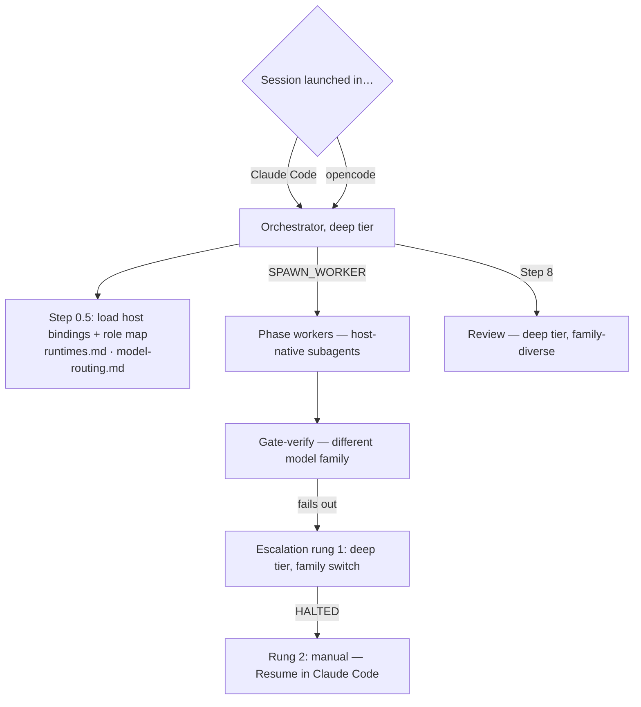

# implement-plan Goes Multi-Runtime

> Make `workflow-kit:implement-plan` run natively on either Claude Code or opencode —
> whole run on one harness, chosen by where you launch — with model routing per role
> and a clean path to adding more harnesses later.

---

## TL;DR

- **One run, one harness.** Launch in Claude Code → all roles on Claude models. Launch in
  opencode → all roles on OpenCode Go's flat-rate open-weight models. No cross-harness
  subprocess bridge — that design was explored and dropped (see Decisions).
- **The skill learns a neutral vocabulary.** Model *tiers* (`light`/`standard`/`deep`) and
  *capability names* (`SPAWN_WORKER`, `STOP_WORKER`, …) replace hardcoded `haiku|sonnet|opus`
  and Claude tool names. Two small reference files bind vocabulary → each host.
- **Quality is protected by the existing gate, not by model choice.** The two-tier verify
  contract is untouched; plus a new *diversity rule*: the model checking work comes from a
  different model family than the one that wrote it.
- **Model defaults are measured, not guessed** — a three-canary bake-off across the
  opencode-go catalog picks per-role defaults.
- **Six stages:** probe → author runtime layer → rewrite SKILL.md → propagate → validate on
  both hosts → release v3.0.0.

---

## Key Decisions

| Decision | Rejected alternative | Why |
|---|---|---|
| Homogeneous runs (harness chosen at launch) | Claude orchestrator shelling out to `opencode run` workers | The cross-runtime seam held every hard problem: subprocess permission scoping, headless-`ask` deadlock, output-envelope parsing, silent-fallback billing. Deleting the seam deletes ~40% of the work |
| Tier + capability vocabulary in SKILL.md | Per-harness forks of the skill | One source of truth; adding a harness never touches SKILL.md again |
| Escalation rung 2 is **manual** ("Resume in Claude Code" block in the HALTED report) | Automatic cross-harness escalation | Automatic would resurrect the subprocess bridge for a path that fires rarely; manual matches the existing user-wait flow |
| Model defaults from a measured bake-off | Hand-picked from reputation | Catalog is a moving target; tool-call discipline matters more than benchmark rank and only measurement reveals it |
| Diversity rule (verifier/reviewer ≠ implementer's model family) | Same strong model everywhere | Same-family models share blind spots; cross-family checking is free on a flat-rate plan |
| Degraded capabilities are disclosed, never simulated | Best-effort emulation of missing primitives | If a host can't cancel a runaway worker, the user should know at Step 2 — not discover it mid-burn |

---

## How It Works

Three layers:

1. **SKILL.md** — the workflow, written entirely in tiers + capability names. Never mentions
   a harness, tool, or model id.
2. **`references/runtimes.md`** — capability-binding table: one column per host, each cell a
   native binding or an explicit `unavailable → consequence` entry. Host detected at Step 0.5
   (orchestrator inspects its own toolset; `HOST_RUNTIME` overrides; wrong guess fails loudly).
3. **`references/model-routing.md`** — per-role model map per host, family groupings, the
   diversity rule, escalation ladder.

New user-visible behavior: **Step 2 becomes a disclosure** — host, per-role models, and
anything degraded on this host, one line each, before any work starts. **Step 9's report**
gains a `Runtime & Models` section: per-phase (tier, model), degradations, and a cost line
(metered Claude spend vs flat-rate note).

Unchanged on purpose: two-tier verification, retry budgets, commit-per-phase, worktree
lifecycle, atomic parallel-group advance, checkbox protocol, severity-gated auto-fix.

---

## Model Routing

Per-role map. The opencode column is a **pre-bake-off hypothesis** — Stage 1's measurements
replace it.

| Role | Tier | Claude Code | opencode (hypothesis) |
|---|---|---|---|
| Orchestrator | deep | `opus` | `kimi-k3` |
| Prep parse | standard | `sonnet` | `qwen3.7-plus` |
| Phase — mechanical | light | `haiku` | `kimi-k2.7-code` |
| Phase — normal | standard | `sonnet` | `glm-5.3` |
| Phase — complex | deep | `opus` | `kimi-k3` |
| Gate-verify (exit-code) | light | `haiku` | `deepseek-v4-flash` |
| Gate-verify (behavioral) | standard | `sonnet` | `qwen3.7-plus` |
| Review | deep | `opus` | `qwen3.8-max` |
| Fix | standard | `sonnet` | `glm-5.3` |
| Escalation rung 1 | deep | `opus` | different deep family than failed implementer |

**Principles (normative):**

1. **Tool-call discipline outranks raw capability** for orchestrator and gate roles — a model
   that fumbles tool JSON stalls the pipeline; a disciplined mediocre one writes mediocre code
   the gate catches.
2. **Diversity rule:** gate-verify and review use a different model *family* than the
   implementer they check; escalation rung 1 switches family from the failed implementer.
3. **Flat-rate changes tier economics:** inside opencode, tiers exist for latency and plan
   limits, not cost — never pick a weaker model to "save" un-metered tokens. On Claude, tiers
   still save real money.
4. **Unknown model ids error loudly, never substitute** — the catalog drifts.

Config: per-role overrides (`ORCHESTRATOR_MODEL`, `PHASE_MODEL_LIGHT|STANDARD|DEEP`,
`VERIFY_MODEL`, `REVIEW_MODEL`, `FIX_MODEL`, `PREP_MODEL`, `ESCALATION_LADDER`). Existing
`PREP_AGENT_MODEL` / `VERIFY_AGENT_MODEL` become deprecated aliases. `PHASE_TOKEN_CEILING`
keyed by tier — light 80k / standard 150k / deep 250k, values unchanged.

---

## The Work

Six stages. A stage starts when the previous one finishes; tasks inside a stage run in
parallel where marked.

### Stage 1 — Ground truth (2 tasks, parallel)

Everything downstream is written from *recorded output*, never assumption. If these probes
can't run, do them manually before Stage 2 — this stage is deliberately blocking.

**1a. Probe opencode's host primitives** → `docs/research/opencode-host-primitives.md`
Native subagent spawn (and per-spawn model pinning), parallelism/background support,
cancellation (`SessionAbort` reachability from a running agent), per-subagent token totals,
whether subagents see `skills.paths` skills (decides if the consumer's `/verify` just works),
headless permission behavior, and whether OpenCode Go meters usage.
*Done when:* each of those seven questions has a yes/no + evidence; degradation paths stated
for anything absent.

**1b. Model bake-off** → `docs/research/model-bakeoff.md`
Three canaries, fresh scratch worktree each, real verify command:
- *Coding* (implementer tiers): small spec'd function + test; pass@1, latency, edit discipline.
- *Tool discipline* (orchestrator/gate roles): ~10 sequential tool calls; failure/retry rate
  measured separately from task success — this metric picks these roles.
- *Fidelity* (prep parse): verbatim extract of a 200-line plan, diffed against ground truth.
Candidates: `kimi-k3`, `kimi-k2.7-code`, `glm-5.3`, `qwen3.7-plus`, `qwen3.8-max`,
`deepseek-v4-flash`, `deepseek-v4-pro`, `minimax-m3`, plus lineage-distant reviewer wildcards
`gpt-5.6-luna`, `grok-4.5`.
*Done when:* results table covers all candidates; recommended per-role map with one-line
justifications; model family groupings recorded for the diversity rule.

### Stage 2 — Runtime layer (2 tasks, parallel)

**2a. Write `references/runtimes.md`** (from 1a)
The capability-binding table (`SPAWN_WORKER`, `STOP_WORKER`, `PACE`, `TOKEN_ACCOUNTING`,
`VERIFY`, `WORKTREE_CREATE`, `NOTIFY`, `REVIEW`) with a claude-code column and an opencode
column. Host-detection rule; disclosure requirement wiring (Step 2 + Step 9); parallel-group
availability per 1a. **Plus the "Adding a host" section** — see *Extending* below; this file
is where the checklist lives.
*Done when:* every capability has a native binding or explicit unavailable+consequence entry
per host; detection, disclosure, and the new-host checklist are all specified; every opencode
cell sourced from 1a's recorded output.

**2b. Write `references/model-routing.md`** (from 1a + 1b)
The routing table and four principles above, opencode column replaced by 1b's measured
recommendations; family groupings; within-host escalation ladder + manual rung 2; config
surface with deprecated aliases and loud-failure rule.
*Done when:* table complete for both hosts and marked bake-off-governed; diversity rule and
ladder normative; tier ceilings preserved.

### Stage 3 — Rewrite SKILL.md (1 task, solo)

Solo because SKILL.md is the vocabulary source of truth for every Stage 4 edit.

**3. Rewrite `SKILL.md`** — roles restated as tiers; new Step 0.5 (detect host, load
bindings + role map, note degradations) added to the mandatory pre-flight; Step 2 becomes the
runtime/model/degradation disclosure; 5a.2 + Step 6 tables emit tiers; capability names
replace `Agent`/`TaskStop`/`ScheduleWakeup`; escalation per 2b; Step 9 gains
`Runtime & Models`; config section updated; frontmatter mechanism sentence updated with every
trigger phrase preserved verbatim.
*Done when:* grep shows no normative Claude tool/model names; Step 0.5 + disclosure + report
sections present; all pre-existing defaults unchanged; behavior changes zero (vocabulary and
routing only — anything behavioral gets raised, not made).

### Stage 4 — Propagate (4 tasks, parallel — disjoint files)

**4a. `references/phase-execution.md`** — tier table, `SPAWN_WORKER` spawn text, runtime-
neutral worktree-ownership rule (orchestrator creates/owns all worktrees; workers never do),
opencode parallel-group paragraph matching 1a's finding (concurrent, or demote-all-to-
sequential). File-overlap demotion + commit-per-phase contract unchanged verbatim.

**4b. `references/runaway-guard.md`** — one contract, two implementations. Claude side
unchanged; opencode side exactly what 1a found — if no cancellation primitive, the guard is
*honestly weaker* (post-hoc token ceiling only) and that lands in the Step 2 disclosure.
Do-not-advance-on-trip and notify payload unchanged.

**4c. `references/escalation.md`** — within-host ladder: rung 1 = deep tier, family switch,
payload carries all prior attempts' verbatim errors; rung 2 = HALTED gains a **"Resume in
Claude Code"** block (worktree path, failed phase, relaunch instruction). BLOCKED/HALTED
formats otherwise unchanged; HALTED lists rungs run (model + family).

**4d. Consumer docs** — `README.md` opencode-host setup (install/auth; register *both* this
repo's and the consumer project's skills in `skills.paths` — exact snippet; model overrides;
honest list of what's weaker on opencode) + `CLAUDE.md` plugin description. Claude Code path
documented as the unchanged default.

### Stage 5 — Validate (1 task, solo)

**5. Dual-host end-to-end** → `docs/research/runtime-validation.md`
Throwaway plan (mechanical phase, normal phase, one file-disjoint parallel pair) against a
scratch project with a real verify skill. Three runs:
1. *Claude Code — regression:* must be behaviorally identical to pre-change; any difference is
   a Stage 3/4 bug.
2. *opencode — new path:* detection, disclosure, per-role models, parallel behavior per 1a,
   diversity rule observed, checkboxes, `Runtime & Models` report.
3. *opencode — forced failure:* plant a failure the standard implementer can't fix; confirm
   family switch at rung 1, HALTED rescue block, then **actually resume in Claude Code** and
   finish the phase — proving the manual rescue end-to-end.
Record token/cost totals so the savings claim is measured. **Extract the harness as a
reusable script** (`scripts/validate-runtimes.sh` or similar) — at two hosts it's a
convenience; at three or more it's the only way validation cost stays sane. Findings are
filed, never patched inline to make a run pass.

### Stage 6 — Release (1 task, solo)

**6. Ship v3.0.0** — major bump (config surface changes + new host). Existing
`scripts/release.sh` flow and `release workflow-kit--vX.Y.Z` commit convention. Release
notes: dual-host support, tier vocabulary, per-role map, diversity rule, opencode-host
degradations, deprecated aliases.

---

## Extending to Another Harness

The design is N-host-shaped: **adding a harness never touches SKILL.md or the workflow
references** — it adds columns and runs the empirical passes. `runtimes.md` carries this as
its "Adding a host" section (Stage 2a):

**Capability floor — check before anything else:**
- Loads markdown skills in this SKILL.md format (opencode: `skills.paths`; a harness with its
  own extension format means porting, not binding — stop here)
- Subagent spawn with a prompt payload — no subagents, no orchestrator pattern, full stop
- Shell + file editing + git
- *Degradable* (disclosure pattern handles absence): parallelism, cancellation, token
  accounting, and per-spawn model pinning — note that without model pinning the skill still
  runs but every tier collapses to one model and the routing layer is inert

**Then, per new host:**
1. Probe its primitives (Stage 1a shape) → recorded findings doc
2. Bake off its model catalog (Stage 1b shape) → per-role defaults + families
3. Add its column to `runtimes.md` (bindings or unavailable+consequence)
4. Add its column to `model-routing.md`
5. Run the Stage 5 validation script against it (regression run on existing hosts too)

---

## Risks

- **No Opus anywhere in an opencode run** — orchestration and review quality is the explicit
  bet. Gate protects phase code; nothing gates scheduling or review findings. Mitigations:
  tool-discipline-first selection, family-diverse review, manual Claude rescue.
- **Runaway guard may be weaker on opencode** — if 1a finds no cancellation primitive, a
  runaway subagent burns to completion. Mitigation is honest disclosure; anything harder
  depends on what 1a finds.
- **Bake-off hypotheses may be wrong** — expected; the table is provisional by design and
  measurements govern.
- **Catalog drift** — per-role overrides + loud failure on unknown ids; re-run the bake-off
  when the catalog shifts.
- **Test surface grows with hosts** — the Stage 5 script is the mitigation; budget a full
  dual-host run for every future skill change.
- **Out of scope** — other skills stay Claude-vocabulary; the cross-harness worker bridge is
  dropped, not deferred — revisit only if homogeneous runs prove insufficient.

## Progress

- [ ] Stage 1 — Ground truth (1a probe, 1b bake-off)
- [ ] Stage 2 — Runtime layer (2a runtimes.md, 2b model-routing.md)
- [ ] Stage 3 — Rewrite SKILL.md
- [ ] Stage 4 — Propagate (4a phase-execution, 4b runaway-guard, 4c escalation, 4d consumer docs)
- [ ] Stage 5 — Validate (dual-host end-to-end)
- [ ] Stage 6 — Release v3.0.0
