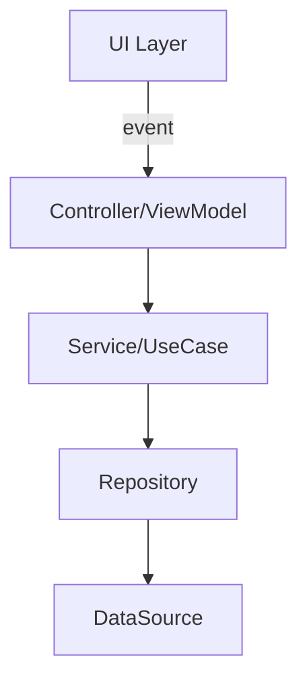

# Feature Plan

Create a structured implementation plan that breaks work into sequential phases with clear
tasks and acceptance criteria checkboxes, then save it so the `implement-plan` skill can pick it up.

## Step 1: Gather Context

If the user already described the feature or bug in their message, proceed directly to research.
Otherwise, ask:

1. What needs to be built or changed?
2. Any known modules, files, or tickets involved?

Keep it to 1–2 questions max. CLAUDE.md and the codebase are often enough context.

## Step 2: Research

Before writing a single task, understand the scope:

1. Read `CLAUDE.md` — source of truth for architecture rules, quality thresholds, and conventions
2. Invoke `/clean-architecture` — get the latest layer rules, patterns, and conventions for
   this codebase before making any structural decisions. Task instructions should reference
   `/clean-architecture` rather than restating its rules.
3. Read relevant source files for the feature area
4. Identify which components need to be created vs modified
5. Identify dependencies between components — which tasks must finish before others can start

The research phase exists so the plan contains real file paths and real class names, not
placeholders. A plan that says "create a service" is less useful than one that says
"create `PropertyDetailsService` in `src/services/`".

**API research (conditional):** After reading source files, check whether the plan
touches any external APIs, libraries, or framework-specific patterns that may have
version-sensitive behavior. Skip entirely for pure business logic changes.

If API surface is involved and `/research` is available:

1. Invoke `/research` for each distinct API surface to check for latest docs,
   deprecated alternatives, migration paths, and version-specific constraints.
2. Incorporate findings into task instructions.

If `/research` is not available, skip the lookup and note it in the plan's
Risks and Considerations section.

## Step 3: Write the Plan

Derive a plan key from the title — lowercase kebab-case, 3–5 words
(e.g., `add-saved-search-alerts`, `fix-notes-persistence`, `websocket-gating`).

Use this structure:

```markdown
# [Plan Title]

## Context
[What this plan accomplishes and why — 2–4 sentences]

## Architecture Diagram
[Only include if the feature introduces non-trivial data flow, a new layer interaction,
or a dependency structure that's hard to convey in prose. Skip for simple single-file changes.]


*(Replace with diagram specific to this feature's actual components and flow)*

## Task Dependency Graph
[Show which tasks are sequential vs parallel within phases]

Example:
  Phase 1 (parallel): Task 1, Task 2
  Phase 2 (sequential, depends on Phase 1): Task 3
  Phase 3 (parallel, depends on Phase 2): Task 4, Task 5

## Tasks

### Phase 1 — [Phase Name]

#### Task 1: [Task Name]
- **Module**: [e.g., `src/services/`]
- **Files**: [exact file paths to create or modify]
- **Dependencies**: None
- **Instructions**:
  [What to implement and why. State what's specific to this task:
   class names, method signatures, contracts with other tasks, what NOT to touch.]

**Acceptance criteria**:
- [ ] [Specific, verifiable criterion]

#### Task 2: [Task Name]
- **Module**: [module path]
- **Files**: [exact file paths]
- **Dependencies**: None
- **Instructions**:
  ...

**Acceptance criteria**:
- [ ] [Criterion]

### Phase 2 — [Phase Name] (depends on Phase 1)

#### Task 3: [Task Name]
- **Module**: [module path]
- **Files**: [exact file paths]
- **Dependencies**: Task 1, Task 2
- **Instructions**:
  ...

**Acceptance criteria**:
- [ ] [Criterion]

## Integration Notes
[How to verify the pieces fit together once all tasks are done]

## Risks and Considerations
[Potential issues, edge cases, or things to watch out for]
```

## Writing a Good Architecture Diagram

A Mermaid diagram earns its place when the dependency structure or data flow would take a
paragraph to describe in prose. Good signals: 3+ new components interacting, a non-obvious
flow (e.g., bidirectional streams, multi-source merges), or a reader would likely draw it
on a whiteboard anyway.

Skip the diagram when the change is local — patching a single class, adding a field to an
existing model, or wiring a new endpoint into an established pattern already documented elsewhere.

If you include one, use real class names from the research phase, not generic labels.
Keep it focused on the new or changed flow — don't diagram the entire app.

Common diagram types:
- `graph TD` — component dependency / data flow (most common)
- `sequenceDiagram` — async interactions (e.g., WebSocket, multi-step auth)
- `stateDiagram-v2` — state transitions

## Writing Good Task Instructions

Write as if handing off to a capable engineer who hasn't seen the rest of the conversation:

- Use real file paths, class names, and function names from the research phase
- Define input/output contracts between tasks so sequential work integrates cleanly
- Call out what NOT to change if there's risk of overlap with sibling tasks
- Keep scope tight — one clear responsibility per task

## Step 4: Save the Plan

Invoke `/save-plan` with the plan key and plan content.

If `/save-plan` is not available, fall back to writing the plan to the working directory:

```bash
<plan-key>.md  # in current working directory
```

Tell the user which path was used.

## Step 5: Report

After saving, tell the user:
1. Where the plan was saved
2. Brief summary: how many phases, how many tasks, rough breakdown of what each phase covers
3. Any risks or open questions they should decide before implementing
